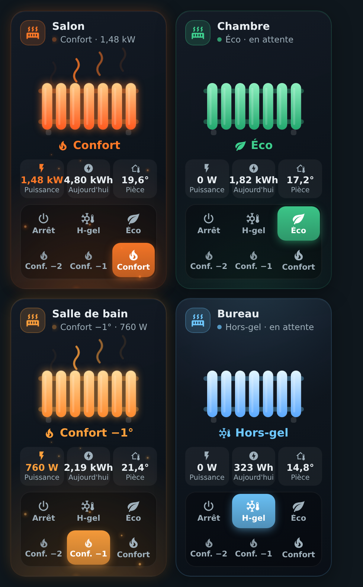
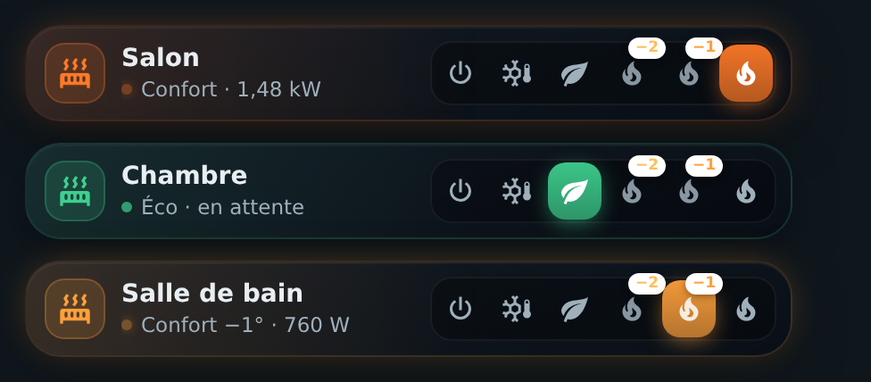

# 🔥 HOLM Radiator Card

[](https://hacs.xyz/)


**Vos radiateurs électriques à fil pilote, enfin lisibles : on voit d'un coup d'œil le mode, s'il chauffe vraiment, et ce qu'il consomme.**

HOLM Radiator Card est faite pour les **radiateurs électriques à fil pilote** (entité `select` avec les modes Arrêt / Hors-gel / Éco / Confort −2 / Confort −1 / Confort) et fonctionne aussi avec une entité `climate` à préréglages. Chaque mode a son ambiance, et le radiateur **s'anime seulement quand il consomme réellement**.

> ✨ **Zéro YAML.** On choisit le radiateur : la puissance, l'énergie du jour et la température de la pièce sont **trouvées automatiquement** (même appareil, même pièce).

### En bref

- 🎨 **Une ambiance par mode** : Confort (lueur chaude et ondes de chaleur), Confort −1 / −2 (ambre plus doux), Éco (vert apaisé), Hors-gel (givre), Arrêt (sobre).
- ⚡ **Animation réelle** : les ondes de chaleur ne montent que si le radiateur consomme ; sinon « en attente ».
- 📊 **Trois chiffres utiles** : puissance instantanée, **énergie du jour** (statistiques de Home Assistant, sans helper) et température de la pièce.
- 🔘 **Six modes en un toucher**, réponse immédiate à l'écran.
- 📐 **Deux présentations** : carte (deux par ligne sur mobile) ou **compacte** sur une ligne.
- 🔎 **Détection automatique** des capteurs de puissance, d'énergie et de température, modifiables si besoin.

| Présentation carte | Présentation compacte |
|---|---|
|  |  |

---

## Installation

### Avec HACS (recommandé)

1. HACS → menu ⋮ → **Dépôts personnalisés**.
2. Ajoutez `https://github.com/kaaribou/holm-radiator-card`, catégorie **Tableau de bord** (*Dashboard / Plugin*).
3. Recherchez la carte → **Télécharger**.
4. Rechargez la page (Ctrl + F5).

### Manuellement

1. Copiez `dist/holm-radiator-card.js` dans `config/www/community/holm-radiator-card/`.
2. **Paramètres → Tableaux de bord → ⋮ → Ressources → Ajouter** : `/local/community/holm-radiator-card/holm-radiator-card.js`, type **Module JavaScript**.
3. Rechargez la page.

---

## Utilisation

Ajoutez la carte **HOLM Radiateur** depuis le sélecteur de cartes et choisissez votre radiateur.

```yaml
type: custom:holm-radiator-card
entity: select.radiateur_salon
```

Les libellés des modes sont reconnus automatiquement, en anglais ou en français (`Comfort` / `Confort`, `Eco`, `Anti-freeze` / `Hors-gel`, `Comfort-1`, `Comfort-2`, `Off` / `Arrêt`). Avec une entité `climate`, ce sont ses préréglages qui servent de modes.

## Options

| Option | Description | Par défaut |
|---|---|---|
| `entity` | Radiateur : `select`, `input_select` ou `climate` (**obligatoire**) | — |
| `name` | Nom affiché | nom de l'entité |
| `layout` | `card` (carte) ou `compact` (une ligne) | `card` |
| `show_power` / `show_energy` / `show_temperature` | Afficher la puissance / l'énergie du jour / la température | `true` |
| `power_entity` / `energy_entity` / `temperature_entity` | Capteurs à utiliser à la place de ceux détectés | automatique |
| `icon` | Icône | radiateur |

## FAQ

| Problème | Solution |
|---|---|
| Pas de puissance ni d'énergie | Aucun capteur n'a été trouvé sur le même appareil : indiquez `power_entity` / `energy_entity`. |
| Pas de température | Aucune sonde dans la même pièce : indiquez `temperature_entity`, ou rangez le radiateur et la sonde dans la même pièce. |
| Un mode manque | Le radiateur ne le propose pas dans ses options. |
| La nouvelle version ne s'affiche pas | Videz le cache (Ctrl + F5). |

---

## Un petit merci ?

La carte vous plaît ? Vous pouvez m'offrir une bière 🍺

[](https://paypal.me/kaaribou)

---

## Licence

Code : licence **MIT** — © kaaribou. Voir le [CHANGELOG](CHANGELOG.md).

Fait partie de la collection **HOLM** : [Carburant HOLM](https://github.com/kaaribou/carburant-holm) · [HOLM Navbar Card](https://github.com/kaaribou/holm-navbar-card) · [HOLM Music Card](https://github.com/kaaribou/holm-music-card) · [HOLM Sentinel Card](https://github.com/kaaribou/holm-sentinel-card).
